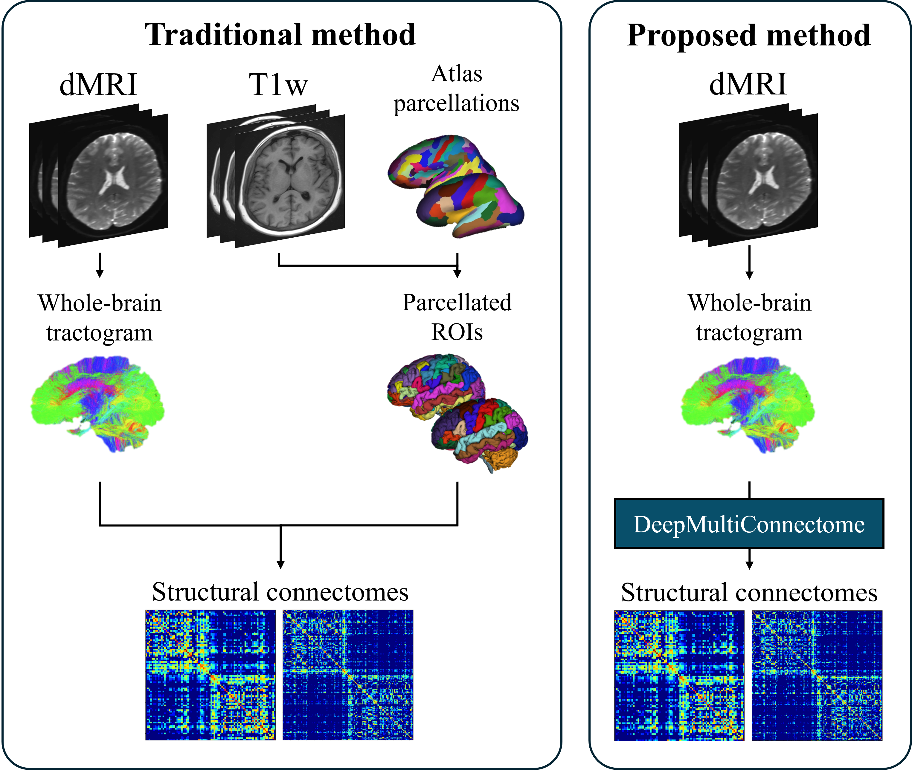

# DeepMultiConnectome

This repository contains the code used to train and evaluate [DeepMultiConnectome](https://doi.org/10.1016/j.neuroimage.2026.121765): Deep multi-task prediction of structural connectomes directly from diffusion MRI tractography. 

DeepMultiConnectome predicts the regions of interest (ROI) that a streamline connects to, enabling the generation of a structural connectome without requiring gray matter parcellation. The model performs multi-task prediction for two atlases simultaneously, namely an 84 ROI Desikan-Killiany and a 164 ROI Destrieux based atlas. The framework is designed to be extensible to additional atlases. The predicted streamline node-pair labels can be used to construct structural connectomes with various weightings (e.g., streamline count, mean FA, or SIFT2).



## License
The contents of this repository are released under an [Slicer](LICENSE) license.


## Installation

### Environment Setup

Create the conda environment from the provided environment file and install WhiteMatterAnalysis:

```bash
conda env create -f environment.yml
conda activate DeepMultiConnectome
pip install git+https://github.com/SlicerDMRI/whitematteranalysis.git
```

### Tractography Software Requirements

For running the tractography data preparation, [MRtrix3](https://www.mrtrix.org/) and [FSL](https://fsl.fmrib.ox.ac.uk/) must be installed seperately


## Data Preparation

### 1. Download Data
This research used the [HCP Young Adult dataset](https://www.humanconnectome.org/study/hcp-young-adult/). Download the required diffusion MRI data.

The parcellation files `aparc+aseg.nii.gz` and `aparc.a2009s+aseg.nii.gz` exist in two locations in the HCP download (`T1w/` and `MNINonLinear/`). This work used the files from the `MNINonLinear/` folder, but either version can be used.

`FreeSurferColorLUT.txt` is required by the tractography pipeline. Download it from the [FreeSurfer wiki](https://surfer.nmr.mgh.harvard.edu/fswiki/FsTutorial/AnatomicalROI/FreeSurferColorLUT) and set `LUT_FILE` at the top of `data/tractography.sh` to its path.

### 2. Preprocessing and Tractography
```bash
bash data/tractography.sh
```

### 3. Prepare Training Data
```bash
python data/prepare_training_data.py
```
This script encodes streamline ROI labels, aggregates tractography outputs into train/val/test pickle files and creates `TrainData_${input_data}` folder for fast loading. Note: set `output_dir` in the script to match the `input_data` tag used in train/test scripts.


## Training and Testing

### Pre-trained Model

A pre-trained model is included at `train_test/trained_model`


### Training

Train a new model from scratch:
```bash
cd train_test && bash train.sh
```


### Testing

Run inference on new subjects:
```bash
cd train_test && bash test.sh
```


### Analysis

Scripts in the `analysis/` folder generate evaluation metrics and figures reported in the paper.

## Citation

If you use this code or model in your research, please cite:

```bibtex
@article{VROEMEN2026121765,
    title = {DeepMultiConnectome: Deep multi-task prediction of structural connectomes directly from diffusion MRI tractography},
    journal = {NeuroImage},
    volume = {328},
    pages = {121765},
    year = {2026},
    issn = {1053-8119},
    doi = {https://doi.org/10.1016/j.neuroimage.2026.121765},
    url = {https://www.sciencedirect.com/science/article/pii/S1053811926000832},
    author = {Marcus J. Vroemen and Yuqian Chen and Yui Lo and Tengfei Xue and Weidong Cai and Fan Zhang and Josien P.W. Pluim and Lauren J. O'Donnell},
}
```